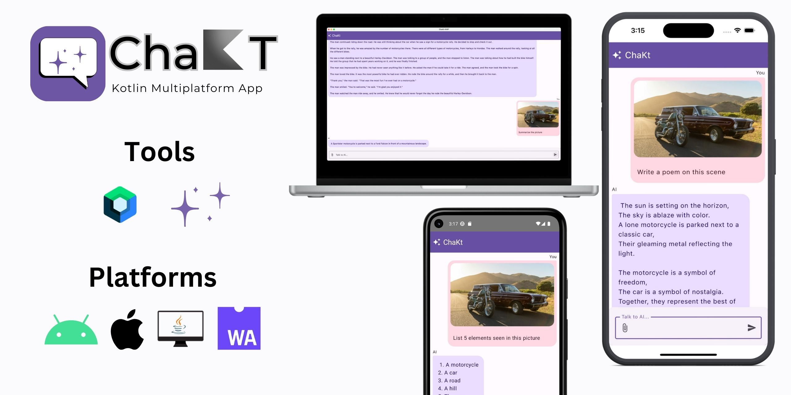
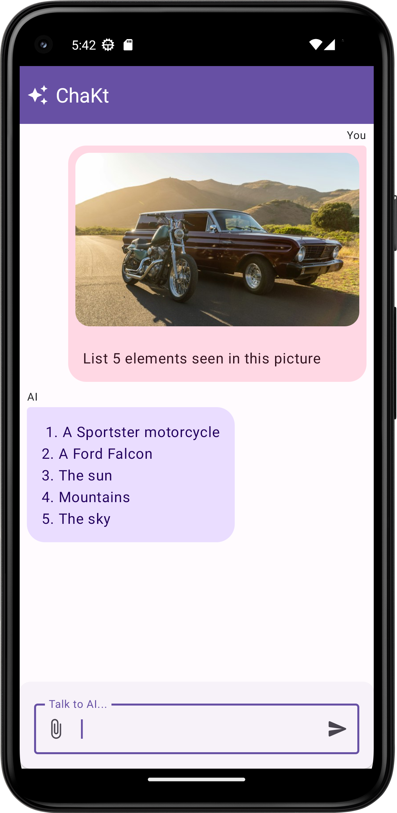
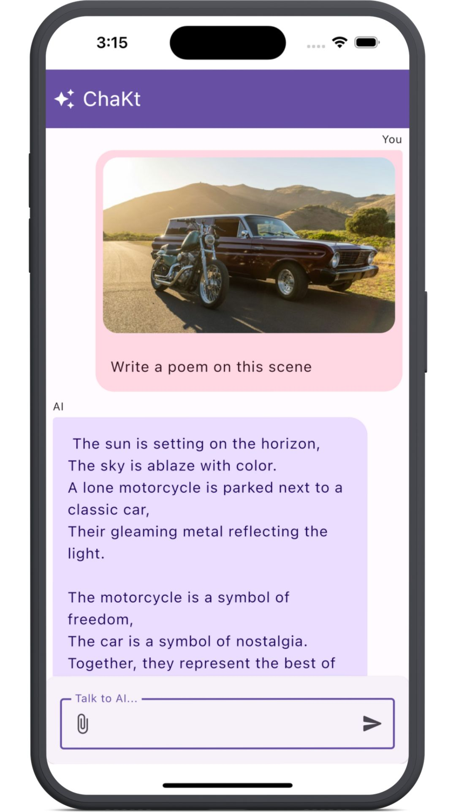
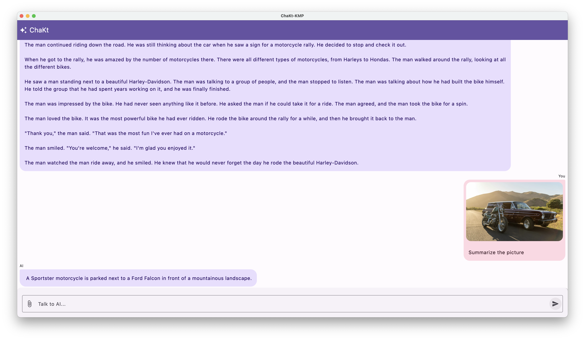
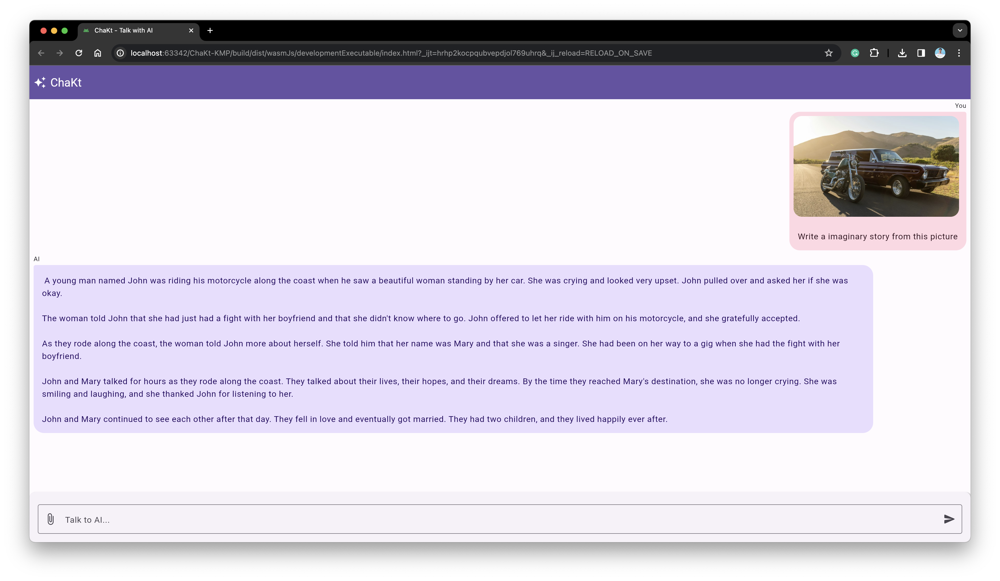

# ChaKt - Chat with AI 💬✨

[](https://github.com/PatilShreyas/ChaKt-KMP/actions/workflows/build.yml)



ChaKt is a multiplatform app built using Kotlin and Compose Multiplatform to demonstrate the use of
[**_Generative AI SDK for Kotlin Multiplatform_**](https://github.com/PatilShreyas/generative-ai-kmp) to generate content using Google's Generative AI
models. It features an simple chat based user interface and experience to interact with AI.

## View App

| Platform | Action                                                                                                                                                                                                                                                                                                                                                                                                                                                                                                                                  |
|----------|-----------------------------------------------------------------------------------------------------------------------------------------------------------------------------------------------------------------------------------------------------------------------------------------------------------------------------------------------------------------------------------------------------------------------------------------------------------------------------------------------------------------------------------------|
| Mobile   | [](https://github.com/PatilShreyas/ChaKt-KMP/releases/latest/download/chakt-android.apk)                                                                                                                                                                                                                                                                                                                                                            |
| Desktop  | [](https://github.com/PatilShreyas/ChaKt-KMP/releases/latest/download/chakt-windows-x64.jar) [](https://github.com/PatilShreyas/ChaKt-KMP/releases/latest/download/chakt-macos-x64.jar) [](https://github.com/PatilShreyas/ChaKt-KMP/releases/latest/download/chakt-linux-x64.jar) |
| Web      | View: https://patilshreyas.github.io/ChaKt-KMP                                                                                                                                                                                                                                                                                                                                                                                                                                                                                          |

## Screenshots

<table>
    <tr>
        <td></td>
        <td></td>
    </tr>
    <tr>
        <td></td>
        <td></td>
    </tr>
</table>

## Built with 🛠️

- [Kotlin Multiplatform](https://kotlinlang.org/lp/multiplatform/)
- [Kotlin Coroutines](https://github.com/Kotlin/kotlinx.coroutines)
- [Compose Multiplatform](https://www.jetbrains.com/lp/compose-multiplatform/)
- [Generative AI SDK](https://github.com/PatilShreyas/generative-ai-kmp)
- [Calf - File picker](https://github.com/MohamedRejeb/Calf)
- [BuildKonfig](https://github.com/yshrsmz/BuildKonfig)

## Development 🛠️

### Pre-requisites

- Java JDK 17+
- Latest stable version of Android Studio IDE
- Latest XCode (_for iOS_)
- Gemini API Key (_Get it from [here](https://makersuite.google.com/app/apikey)_)

### Setup

- Clone this repository.
- Open in the _latest version_ of Android Studio.
- Place your Gemini API key in `local.properties` file as `gemini_api_key` property.

Example:

```properties
gemini_api_key=YOUR_API_KEY
```

- Run the app on your device or emulator:
    - For Android, run `composeApp` module by selecting `app` configuration.
    - For iOS, run `composeApp` module by selecting `iosApp` configuration.
    - For Desktop, run `./gradlew :composeApp:run`
    - For Web, run `./gradlew :composeApp:wasmJsBrowserDevelopmentRun`

## Contributing 🛠️

Please read [CONTRIBUTING.md](CONTRIBUTING.md) for details and the process.

## License

```
MIT License

Copyright (c) 2024 Shreyas Patil

Permission is hereby granted, free of charge, to any person obtaining a copy
of this software and associated documentation files (the "Software"), to deal
in the Software without restriction, including without limitation the rights
to use, copy, modify, merge, publish, distribute, sublicense, and/or sell
copies of the Software, and to permit persons to whom the Software is
furnished to do so, subject to the following conditions:

The above copyright notice and this permission notice shall be included in all
copies or substantial portions of the Software.

THE SOFTWARE IS PROVIDED "AS IS", WITHOUT WARRANTY OF ANY KIND, EXPRESS OR
IMPLIED, INCLUDING BUT NOT LIMITED TO THE WARRANTIES OF MERCHANTABILITY,
FITNESS FOR A PARTICULAR PURPOSE AND NONINFRINGEMENT. IN NO EVENT SHALL THE
AUTHORS OR COPYRIGHT HOLDERS BE LIABLE FOR ANY CLAIM, DAMAGES OR OTHER
LIABILITY, WHETHER IN AN ACTION OF CONTRACT, TORT OR OTHERWISE, ARISING FROM,
OUT OF OR IN CONNECTION WITH THE SOFTWARE OR THE USE OR OTHER DEALINGS IN THE
SOFTWARE.
```
